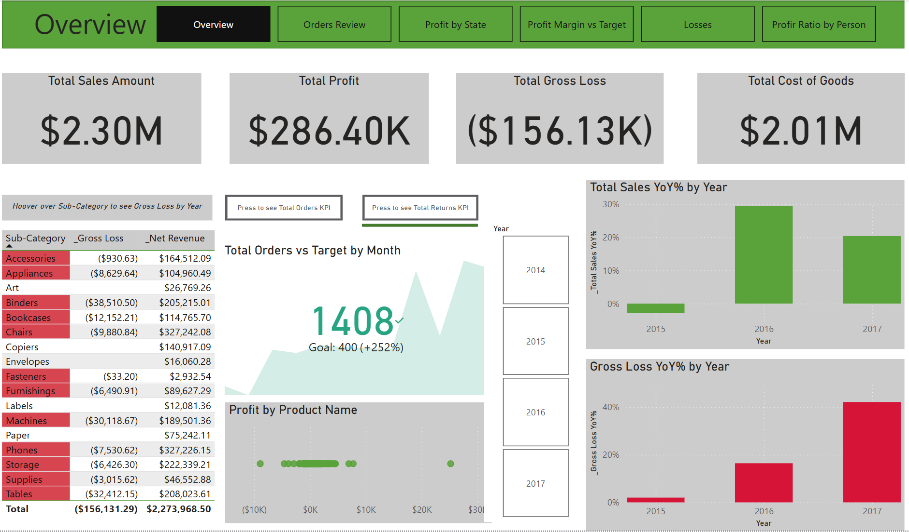
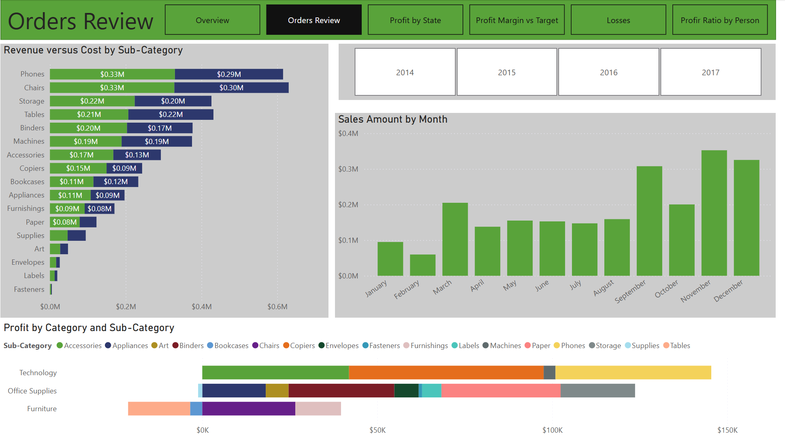
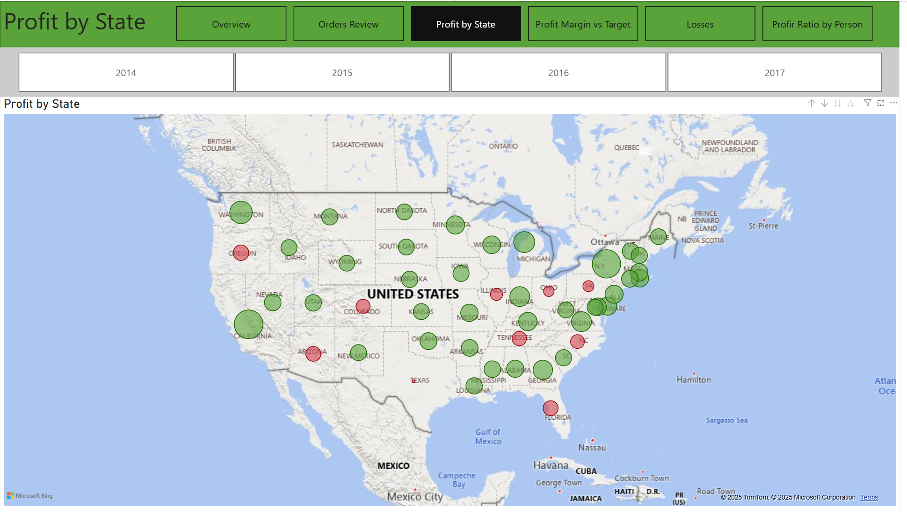
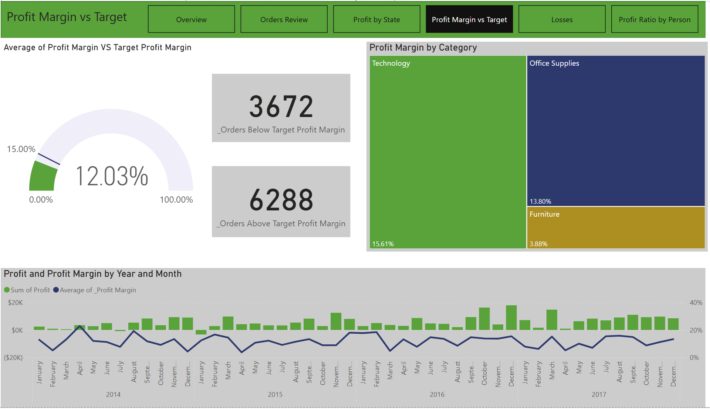
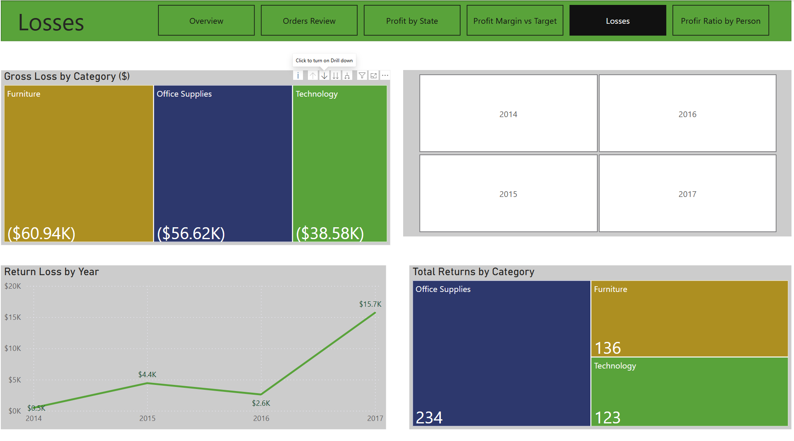
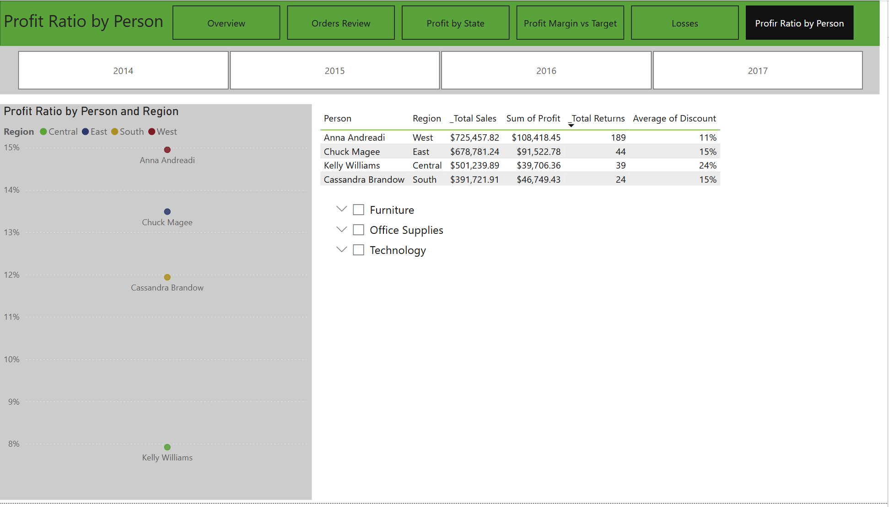

# 📊 Power BI Sales Report

## 📌 Project Overview
This Power BI Sales Report analyzes sales performance across various product categories and U.S. regions. It identifies trends, evaluates targets, highlights top-performing and underperforming products, and examines seasonal patterns, profitability, losses, and returns.

---

## 📂 Data Source
- **Dataset**: Sample Superstore Sales Data
- **Source**: GitHub Repository
- **Details**: The dataset represents sales data for a fictional retail company, including variables such as Order ID, Customer ID, Product ID, Region, Category, Sub-Category, Product Name, Sales, Quantity, Discount, and Profit.

---

## 🔄 Data Transformation
- Standardized data formats in **Power Query**.
- Promoted the first row to headers.
- Created a separate **"Products"** table from the "Orders" table.
- Verified data quality using **Column Quality, Column Distribution, and Column Profile** tools.

---

## 🔗 Data Modeling
- Established **table relationships** to ensure accurate aggregations and insights.

---

## 📊 DAX Measures & Calculations
Implemented key metrics, including:

### **Profitability & Losses**
- `_COGS`, `_Gross Loss`, `_Gross Loss YoY%`, `_Maximum Profit Margin`, `_Profit Margin`, `_Profit Ratio`, `_Return Loss`, `_Target Returns`, `_Total Returns`

### **Sales & Orders**
- `_Total Orders`, `_Total Sales`, `_Total Sales YoY%`, `_Orders Above Target Profit Margin`, `_Orders Below Target Profit Margin`

### **Targets**
- `_Target Orders = 400`
- `_Target Profit Margin = 0.15`

---

## 📈 Visualizations
Utilized various charts and visuals for better insights:
- **KPIs**, **cards**, **bar charts**, **column charts**, **scatter charts**, **gauge charts**, **line graphs**, **tables**, and **maps**.

---

## 🎛️ Interactivity
Enhanced user experience with:
- **Page navigators**, **tooltips**, **buttons**, **bookmarks**, **slicers**, and **treemaps**.

---

## 📌 Conclusions
### 🔍 **Profitability Analysis**
- **Least Profitable Product**: `Cubify CubeX 3D Printer` (Gross loss: **$8,879.97**, 2014–2017).
- **Top-Performing Product**: `Canon imageCLASS 2200 Advanced Copier` (Total profit: **$25,199.93**, 2014–2017).

### 🌍 **Regional Performance**
- **Top-Performing Regions**: 
  - California (**$76,381.39** profit)
  - New York (**$74,038.55** profit)
- **Underperforming Region**:
  - Texas incurred the highest losses (**$25,729.36** loss).

### 📦 **Product Category Trends**
- **Highest Profit Margins**: Technology products.
- **Lowest Profit Margins**: Furniture category.
- **Highest Net Revenue Products**: Chairs, phones, and storage.
- **Highest Gross Loss Sub-Categories**: Binders, tables, and machines.

### 📅 **Seasonal Trends**
- **Peak Sales Months**: September, November, and December.
- **Lowest Sales Month**: February.

### 🏆 **Top Sales Representative**
- **Anna Andreadi** generated the highest sales and profit.

---

### 📸 **Screenshots** ## 

### **1️⃣ Overview of Sales Report**

### **2️⃣ Orders Review**

### **3️⃣ Profit by State**

### **4️⃣ Profit Margin vs Target**

### **5️⃣ Losses Analysis**

### **6️⃣ Profit Ratio by Sales Representative**

